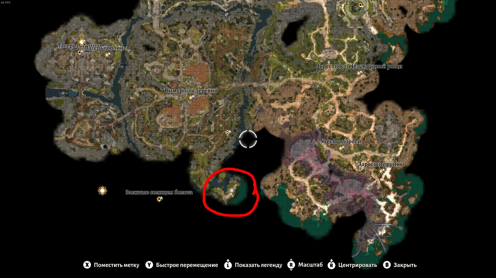
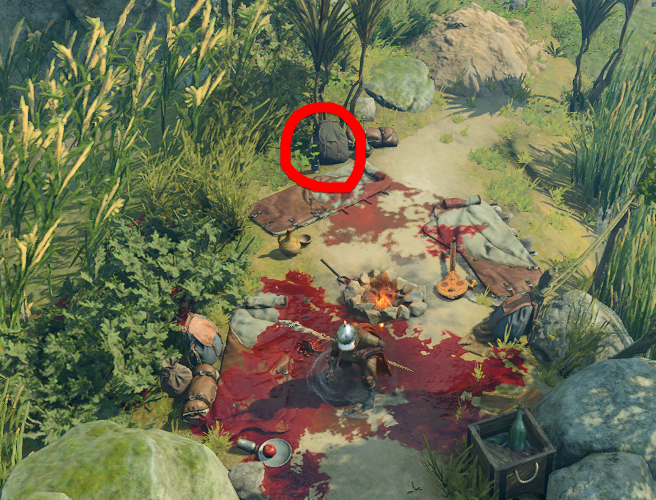

# About

This mod for Baldur's Gate 3 adds 4 mysterious items to the game. To find out more, find items in the game :)

# Installation

1. Install [BG3ModManager](https://github.com/LaughingLeader/BG3ModManager) according to instructions.
2. Download [mod](https://github.com/Clovis1444/BG3_CLVS/releases/latest).
3. Open [BG3ModManager](https://github.com/LaughingLeader/BG3ModManager). Go to: "File" -> "Import Mod..." -> specify the path to [the archive](https://github.com/Clovis1444/BG3_CLVS/releases/latest) downloaded in the previous step.
4. Drag "CLVS" from inactive mods (right side of the window) to active mods (left side of the window).
5. Press "Export Order to Game" button. You may close [BG3ModManager](https://github.com/LaughingLeader/BG3ModManager) now.
6. Launch game and have fun!

# Enabling achievements

By default mods disable achievements in BG3. Fortunately, there is a mod that prevents this from happening.
To enable achievements just install [this mod](https://www.nexusmods.com/baldursgate3/mods/668) according to instructions

# Where to find the items

All the items that this mod adds can be found in the backpack in Destroyed Campsite (X:86; Y:274) in Act 1.

